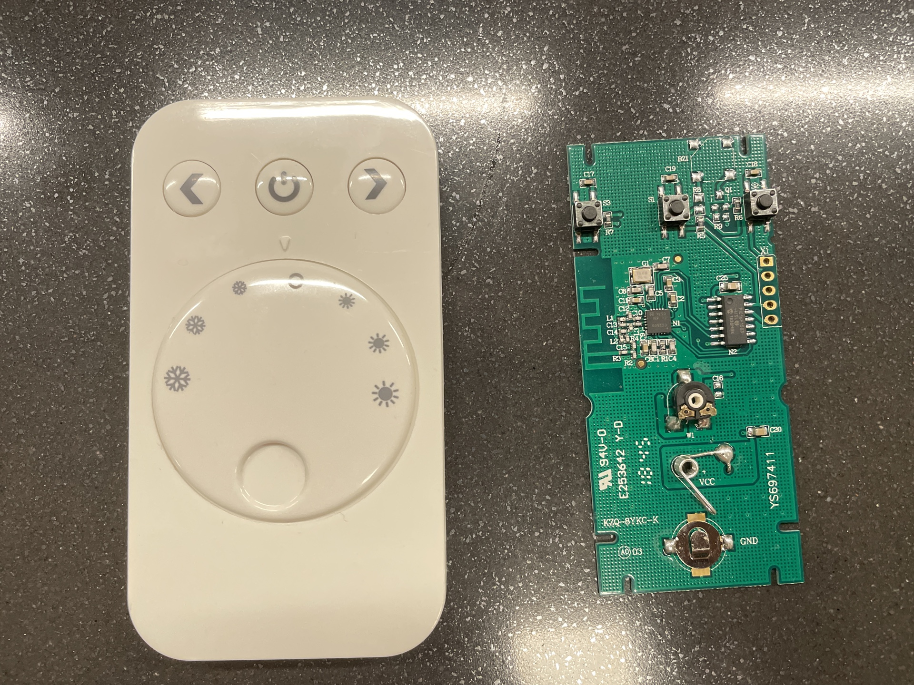
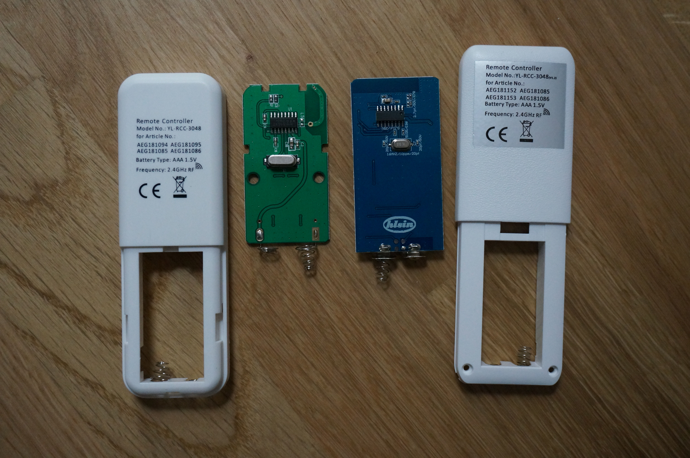

# Home Automation Hub

This project contains the firmware for my self-built home automation hub. It's based on nRF52811 chip and runs on
mbedOS. Some of the dependencies, as well as the mbedOS itself, were customized for the hardware, so building the
project as is might be difficult.

The most interesting part of the project are reversed-engineered protocols for several LED lights available on the
German market, although the protocols are far from being fully specced out: the ID of the remote is not identified (I
only have one of each type of remote), there are some magic rules for some of the bits, etc. Nevertheless, this might be
a good starting point if you have a similar device.

Here are the remotes that this code successfully imitates every day:

#### Emotion Control L&S

_Some keywords from the PCB: KZQ-8YKC-K, YS697411, E253642_

This one is the easiest: a separate CC2500 radio chip allows an easy interception of the commands. The packets
themselves are static, so just repeat as needed. See `off` and `on` in `main.cpp`, as well as `LIGHT_CFG`
in `cc1101.cpp`.

#### YL-RCC-3048

There are at least two different variants of this remote, which are completely incompatible with each other. Both are
based on unknown chips, so the only way is to intercept the radio. Each packet is somewhat unique: there are
interdependent bits which are expected to change in a certain way. This logic is important, so sending commands from
different remotes with the same ID might hang the controller in the light, requiring a power reset.

The implementation is in `AEG1.cpp` for the v1.2 of the remote ("blue"), and in `AEG2.cpp` for the unmarked version ("green").